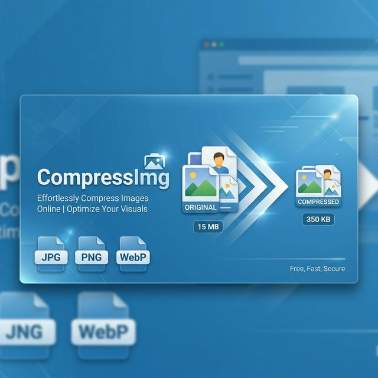

<p align="center">
  
</p>

<h1 align="center">CompressImg</h1>

<p align="center">
  <strong>The World's Best Free Online Image Compressor</strong><br>
  100% Browser-Based • No Server Uploads • Complete Privacy
</p>

<p align="center">
  <a href="https://compressimg.org">🌐 compressimg.org</a> •
  <a href="#features">Features</a> •
  <a href="#supported-formats">Formats</a> •
  <a href="#tech-stack">Tech Stack</a> •
  <a href="#installation">Installation</a> •
  <a href="#languages">Languages</a>
</p>

<p align="center">
  
  
  
  
  
</p>

---

## About

**CompressImg** is a powerful, client-side image compression tool that processes images entirely in the browser. Unlike traditional compressors that upload your files to remote servers, CompressImg ensures your images **never leave your computer** — providing unmatched privacy and speed.

🔗 **Live Site:** [https://compressimg.org](https://compressimg.org)

---

## Features

| Feature | Description |
|---------|-------------|
| 🔒 **100% Client-Side** | All compression happens in your browser. No server uploads, ever. |
| ⚡ **Ultra Fast** | Up to 10x faster than server-based competitors. No network latency. |
| 💰 **100% Free** | No registration, no limits, no hidden costs. Completely free forever. |
| 🎚️ **3 Quality Levels** | High (80%), Medium (50%), and Low (20%) compression presets. |
| 📦 **Batch Processing** | Compress unlimited images at once with bulk download. |
| 🌍 **7 Languages** | Full internationalization: EN, PT, ES, FR, ZH, HI, RU. |
| 📱 **Responsive Design** | Works perfectly on desktop, tablet, and mobile devices. |
| 🔍 **SEO Optimized** | JSON-LD, OpenGraph, Twitter Cards, hreflang, RSS, sitemaps. |
| 🎨 **Retro 2013 Theme** | Nostalgic Bootstrap 3 design with a blue color scheme. |

---

## Supported Formats

CompressImg supports **8 image formats**, more than most competitors:

| Format | Type | Compression Method |
|--------|------|-------------------|
| **JPG / JPEG** | Raster | Lossy via Canvas API |
| **PNG** | Raster | Lossless / Lossy (quality-dependent) |
| **GIF** | Raster | Converted to JPEG via Canvas |
| **WebP** | Raster | Lossy via Canvas API |
| **SVG** | Vector | XML minification (comments, whitespace removal) |
| **BMP** | Raster | Converted to more efficient format |
| **TIFF** | Raster | Converted to JPEG via Canvas |
| **ICO** | Raster | Converted to JPEG via Canvas |

---

## 3 Compression Levels

| Level | Quality | Best For |
|-------|---------|----------|
| **High** | ~80% | Photography portfolios, professional design |
| **Medium** | ~50% | Websites, blogs, social media, e-commerce |
| **Low** | ~20% | Thumbnails, previews, maximum speed |

---

## Tech Stack

### Backend
- **Framework:** [Laravel 9.x](https://laravel.com/) (PHP)
- **Templating:** Blade Templates
- **Localization:** Laravel's built-in `lang/` translation system
- **Routing:** Locale-prefixed routes (`/{locale}/`)

### Frontend
- **CSS Framework:** [Bootstrap 3.3.7](https://getbootstrap.com/docs/3.3/) (Retro 2013 aesthetic)
- **Typography:** [Google Fonts](https://fonts.google.com/) — Open Sans + Oswald
- **Icons:** [Font Awesome 4.7](https://fontawesome.com/v4/)
- **JavaScript:** Vanilla JS (ES5 compatible, no build step)
- **jQuery:** 1.12.4

### Image Compression
- **Engine:** Browser Canvas API (`canvas.toBlob()`)
- **SVG:** Custom XML minifier (removes comments, collapses whitespace)
- **Processing:** 100% client-side — zero server interaction

### SEO
- OpenGraph & Twitter Card meta tags
- JSON-LD structured data (NewsArticle + WebApplication)
- Hreflang tags for all 7 languages
- XML Sitemap Index with per-locale sitemaps
- RSS Feed per locale

---

## Languages

CompressImg is fully translated into 7 languages:

| Code | Language | File |
|------|----------|------|
| `en` | 🇬🇧 English | `lang/en/messages.php` |
| `pt` | 🇧🇷 Português | `lang/pt/messages.php` |
| `es` | 🇪🇸 Español | `lang/es/messages.php` |
| `fr` | 🇫🇷 Français | `lang/fr/messages.php` |
| `zh` | 🇨🇳 中文 | `lang/zh/messages.php` |
| `hi` | 🇮🇳 हिन्दी | `lang/hi/messages.php` |
| `ru` | 🇷🇺 Русский | `lang/ru/messages.php` |

Each language file contains **219 translation keys** covering the entire UI, article content, SEO metadata, RSS feed, and JSON-LD structured data.

---

## Project Structure

```
compress-img/
├── app/
│   └── Http/
│       ├── Controllers/
│       │   └── PageController.php      # Main controller (home, RSS, sitemap)
│       └── Middleware/
│           └── SetLocale.php           # Locale detection middleware
├── lang/
│   ├── en/messages.php                 # English translations
│   ├── pt/messages.php                 # Portuguese translations
│   ├── es/messages.php                 # Spanish translations
│   ├── fr/messages.php                 # French translations
│   ├── zh/messages.php                 # Chinese translations
│   ├── hi/messages.php                 # Hindi translations
│   └── ru/messages.php                 # Russian translations
├── public/
│   ├── css/style.css                   # Full custom CSS (retro blue theme)
│   ├── js/compressor.js                # Client-side image compressor
│   └── img/og-cover.png                # OpenGraph cover image
├── resources/views/
│   ├── layouts/app.blade.php           # Main layout (navbar, footer, SEO)
│   └── home.blade.php                  # Homepage (tool + article)
├── routes/
│   └── web.php                         # Locale-prefixed routes
└── README.md
```

---

## URL Structure

| URL | Description |
|-----|-------------|
| `/` | Redirects to `/pt` (default locale) |
| `/{locale}` | Homepage in specified language |
| `/{locale}/feed.xml` | Localized RSS feed |
| `/{locale}/sitemap.xml` | Locale-specific sitemap |
| `/sitemap.xml` | Global sitemap index (all locales) |

**Supported locales:** `en`, `pt`, `es`, `fr`, `zh`, `hi`, `ru`

---

## Installation

### Requirements
- PHP 8.0+
- Composer
- Node.js (optional, for Vite asset compilation)

### Setup

```bash
# Clone the repository
git clone https://github.com/jorgeedvaldo/compress-img.git
cd compress-img

# Install PHP dependencies
composer install

# Copy environment file
cp .env.example .env

# Generate application key
php artisan key:generate

# Start the development server
php artisan serve
```

The application will be available at `http://localhost:8000`.

> **Note:** No database is required. CompressImg is a fully static, client-side tool. The Laravel backend only serves the views, RSS feeds, and sitemaps.

---

## How It Works

1. **User selects images** — via drag & drop or file picker
2. **Chooses quality level** — High (80%), Medium (50%), or Low (20%)
3. **Browser compresses** — using the Canvas API (`toBlob()`) for raster images, or XML minification for SVGs
4. **User downloads** — individually or all at once

The entire process happens in the browser. No data is transmitted to any server.

---

## SEO Features

- ✅ **Meta Tags** — Dynamic title, description, keywords per locale
- ✅ **OpenGraph** — og:title, og:description, og:image, og:locale
- ✅ **Twitter Cards** — summary_large_image with dynamic content
- ✅ **JSON-LD** — NewsArticle + WebApplication schemas
- ✅ **Hreflang** — Alternate links for all 7 languages + x-default
- ✅ **Canonical URLs** — Locale-aware canonical tags
- ✅ **Sitemap Index** — Global sitemap linking per-locale sitemaps
- ✅ **RSS Feed** — Localized RSS 2.0 feed per language
- ✅ **Semantic HTML** — Proper heading hierarchy, article microdata
- ✅ **Long-form Article** — 2000+ word SEO article embedded in each page

---

## Comparison with Competitors

| Feature | CompressImg | TinyPNG | Compressor.io | Squoosh |
|---------|-------------|---------|---------------|---------|
| Client-Side Processing | ✅ Yes | ❌ No | ❌ No | ✅ Yes |
| Supported Formats | **8** | 2 | 4 | 6 |
| Compression Levels | **3** | 1 | 2 | Custom |
| Batch Compression | ✅ Unlimited | 20 | 1 | 1 |
| 100% Free | ✅ Always | Partial | ✅ Yes | ✅ Yes |
| Max File Size | **50MB** | 5MB | 10MB | Variable |
| Total Privacy | ✅ Guaranteed | ❌ No | ❌ No | ✅ Yes |
| Multi-language | ✅ 7 langs | ❌ No | ❌ No | ❌ No |

---

## License

This project is open-sourced software licensed under the [MIT License](https://opensource.org/licenses/MIT).

---

<p align="center">
  <strong>CompressImg</strong> — Compress your images without compromising privacy.<br>
  <a href="https://compressimg.org">🌐 compressimg.org</a>
</p>
